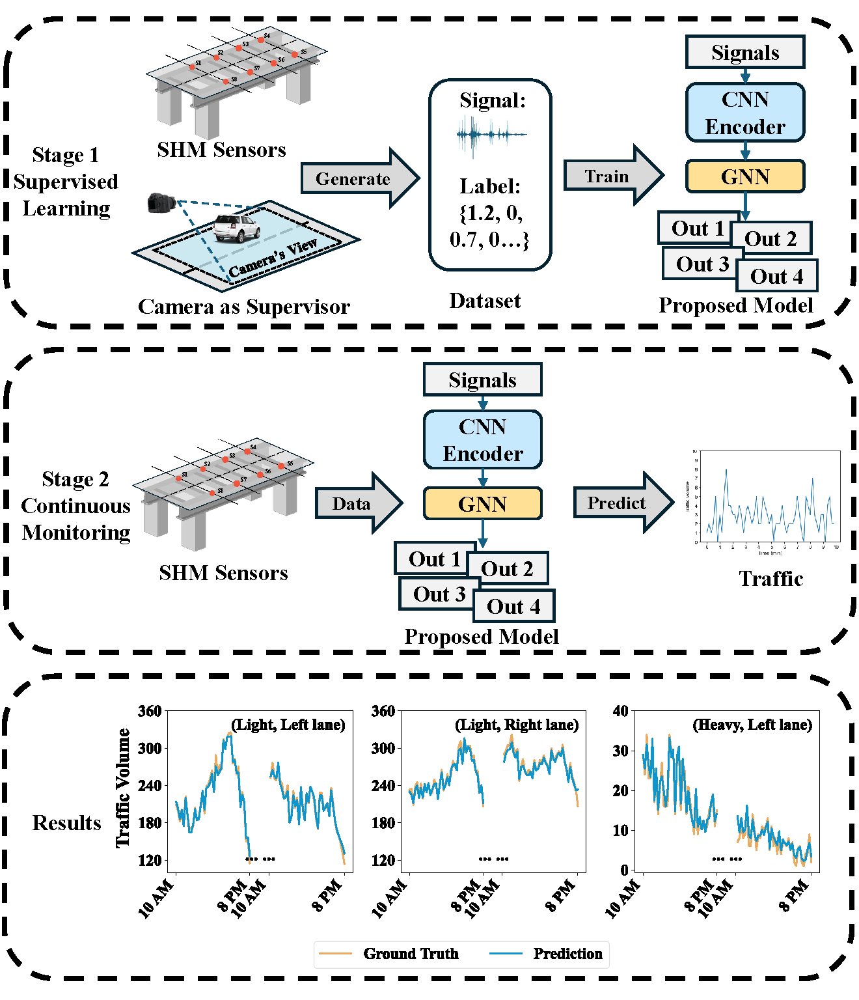

# SHMSN-Traffic-Monitoring

This repository contains the implementation of the paper:

> Wu, H., Jian, X., Lataniotis, C., Hoelzl, C., Chatzi, E., & Reuland, Y. (2025). Automating Traffic Monitoring with SHM Sensor Networks via Vision-Supervised Deep Learning. arXiv preprint, arXiv:2506.19023

## 📣 News

[2025.07.03] We will soon release our codes and data following the publication of our paper.

## 📧 Contact

Please contact hanswu@student.ethz.ch should you have any questions.
